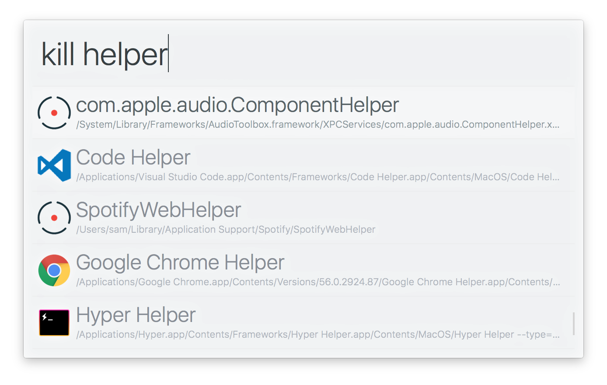

# alfred-fkill [](https://travis-ci.org/SamVerschueren/alfred-fkill)

> [Alfred 3](https://www.alfredapp.com) workflow to fabulously search and kill processes




## Install

```
$ npm install --global alfred-fkill
```

*Requires [Node.js](https://nodejs.org) 4+ and the Alfred [Powerpack](https://www.alfredapp.com/powerpack/).*


## Usage

In Alfred, type `kill`, <kbd>Enter</kbd>, and the name of your process.

To kill a process by its port number, prefix it with a colon. For example: `kill :8080`.

Select an item and press <kbd>Enter</kbd> to kill the process.<br>
Hold <kbd>Shift</kbd> to show the used CPU percentage.<br>
Hold <kbd>Alt</kbd> and press <kbd>Enter</kbd> to force kill the process.


## Related

- [fkill](https://github.com/sindresorhus/fkill) - API for this workflow
- [fkill-cli](https://github.com/sindresorhus/fkill-cli) - CLI version of this workflow


## License

MIT © [Sam Verschueren](https://github.com/SamVerschueren)
